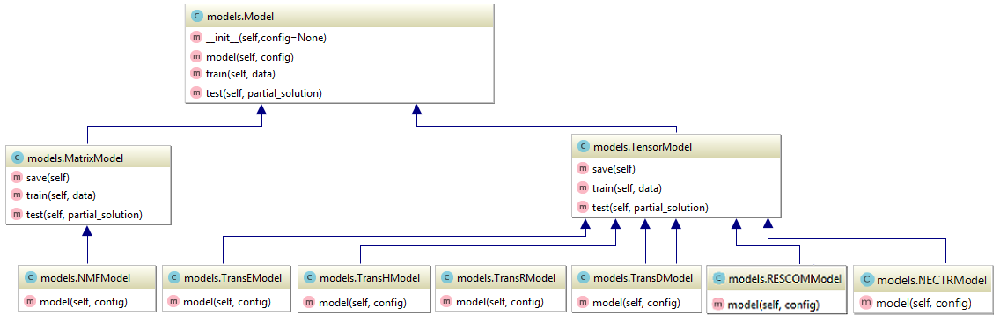

# NECTR

This repository consists of the implementation of a unified recommender system framework for easily integrating matrix and tensor factorization methods.

The methods included are:
- Non-negative Matrix Factorization (NMF)
- [TransE](#transe)
- [TransH](#transh)
- [TransR](#transr)
- [TransD](#transd)
- [RESCOM](#rescom), a modification of [RESCAL](#rescal)
- NECTR

## Technical requirements

* [`Python >=3.6`] (https://www.python.org/)
* [`TensorFlow >=1.9.0`] (https://www.tensorflow.org/)
* [`pandas >=0.23.4`] (https://pandas.pydata.org/)
* [`NumPy >=1.15.0`] (http://www.numpy.org/)
* [`scikit-learn >= 0.19.2`] (https://scikit-learn.org/)

## Data (Movielens 1M)

The models expect data to be given in the following form:

* **triple2id.txt**: All triples that make up the knowledge graph in the form **entity1** x **entity2** x **relation12**. The first line is the number of triples to be used for training (typically, the total number of lines). 
This file can also contain data in the form **entity1** x **entity2** x **relation12** x **count12** where the last entry represents the count, i.e., the number of occurences of the triple in the knowledge graph.
It is especially important for the solutions as the count represents the number of times a specific item has been configured in the corresponding solution. This format is necessary for NECTR as an input to the neural autoencoder.
* **entity2id.txt**: All entities and the corresponding Ids, one per line. The first line is the number of entities.
* **relation2id.txt**: All relations and the corresponding Ids, one per line. The first line is the number of relations.
* **Categories.csv**: Each line has information about a category and the items belonging to that category. This file is used in the category-based evaluation and for visualization.

All text files use `\t` as the column delimiter and the CSV files use `;`.

The automation solution data is available upon request (marcel.hildebrandt@siemens.com).

## Demo

A demo on how to use the recommender system can be found in the [notebook](RecommenderSystem_Demo.ipynb).

## References

<a name="transe">[1] Bordes, Antoine, et al. Translating embeddings for modeling multi-relational data. Proceedings of NIPS, 2013.</a>

<a name="transh">[2]	Zhen Wang, Jianwen Zhang, et al. Knowledge Graph Embedding by Translating on Hyperplanes. Proceedings of AAAI, 2014.</a>

<a name="transr">[3] Yankai Lin, Zhiyuan Liu, et al. Learning Entity and Relation Embeddings for Knowledge Graph Completion. Proceedings of AAAI, 2015.</a>

<a name="transd">[4] Guoliang Ji, Shizhu He, et al. Knowledge Graph Embedding via Dynamic Mapping Matrix. Proceedings of ACL, 2015.</a>

<a name="rescom">[5] Marcel Hildebrandt, Swathi Shyam Sunder, et al. Configuration of Industrial Automation Solutions Using Multi-relational Recommender Systems. Proceedings of ECML-PKDD, 2018.</a>

<a name="rescal">[6] Nickel, Tresp, et al. A three-way model for collective learning on multi-relational data. Proceedings of ICML, 2011.</a>
